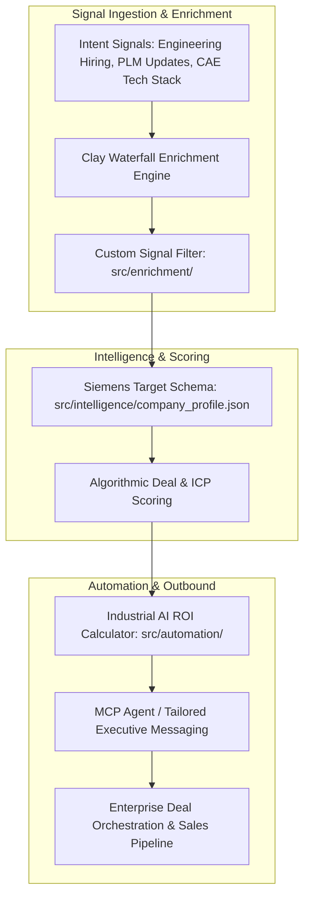

# Maya HTT GTM & RevOps Toolkit

A production-grade, engineering-led Go-To-Market (GTM) strategy and revenue operations toolkit engineered specifically for **Maya HTT**. This repository operationalizes pipeline health, signal-based enterprise prospecting, and dynamic deal orchestration across the Siemens Digital Industries Software ecosystem (Simcenter, Teamcenter, NX, and custom CAE/Digital Twin solutions).

---

## 🏛 System Architecture & Workflow Flowchart



### Directory Manifest

```text
Maya-HTT-GTM-Toolkit/
├── README.md                           # Master architectural overview and execution guide
├── config/                             # Global configuration files and environment definitions
├── docs/                               # Core GTM strategy, value frameworks, and playbooks
│   ├── 01_ICP_and_Industrial_Targeting.md
│   ├── 02_Siemens_Ecosystem_Positioning.md
│   ├── 03_Outreach_and_Executive_Playbook.md
│   ├── 04_90_Day_Execution_Plan.md
│   ├── 05_BVA_and_Executive_Value_Framework.md
│   ├── 06_Signal_Prospecting_Engine.md
│   ├── 07_Enterprise_Deal_Orchestration.md
│   ├── 08_RevOps_Architecture_and_Salesforce_Data_Model.md
│   └── 10_Forecasting_and_Pipeline_Analytics_Dashboards.md
├── src/                                # Core codebase and execution logic
│   ├── automation/                     # ROI calculators, vibe coding, and Clay automation scripts
│   │   ├── 05_Industrial_AI_ROI_Calculator.py
│   │   └── 09_AI_Vibe_Coding_and_Clay_Automations.py
│   ├── core/                           # Base framework modules imported from RevOps engine
│   ├── enrichment/                     # Signal prospecting, intent filtering, and waterfall configs
│   │   └── signals/                    # Raw signal ingestion rules and criteria
│   ├── intelligence/                   # Target account schemas and diagnostic logic
│   │   └── company_profile.json        # Siemens ecosystem target profile definition
│   └── scripts/                        # Utility scripts and operational CLI tools
├── templates/                          # Standardization templates for outbound, signals, and audits
│   ├── tpl_inbound_lead.md
│   ├── tpl_pipeline_audit.md
│   ├── tpl_prospect.md
│   └── tpl_signal.md
└── sync_gtm_toolkit.sh                 # Zsh automation script for upstream synchronization
```

---

## 🚀 Key Modules & Capabilities

### 1. Intelligence & Siemens Ecosystem Schema (`src/intelligence/`)
- **Target Account Schema:** Standardized JSON models capturing high-value target buyer personas (VP of Engineering, Chief Engineer, Head of Simulation/CAE, PLM Administrator).
- **Ecosystem Alignment:** Pre-built attributes mapping Maya HTT's specialized competencies in Digital Twins, Simcenter, Thermal/Flow simulation, and bespoke CAE software.

### 2. Industrial AI & Automation Engines (`src/automation/`)
- **`05_Industrial_AI_ROI_Calculator.py`:** Financial modeling script evaluating engineering efficiency gains, simulation throughput acceleration, and hardware prototype cost reduction for enterprise prospects.
- **`09_AI_Vibe_Coding_and_Clay_Automations.py`:** Programmatic webhook integration connecting Clay waterfall enrichment with automated messaging generation.

### 3. Signal-Based Prospecting & Enrichment (`src/enrichment/`)
- **Signal Ingestion Rules:** Intent tracking across engineering hiring cycles, CAD/CAE software migration events, and PLM infrastructure updates.
- **Waterfall Prospecting:** Multi-stage verification pipelines prioritizing accounts with high thermal/structural simulation requirements.

### 4. Playbooks & RevOps Infrastructure (`docs/`)
- **Siemens Ecosystem Positioning:** Strategic playbook for positioning Maya HTT alongside Siemens native solutions.
- **Enterprise Deal Orchestration:** Stage-by-stage methodology for managing long-cycle engineering sales involving multi-stakeholder approval boards.
- **Salesforce Data Model:** Custom object relationships mapping software licensing, consulting services, and custom software delivery.

---

## 🛠 Setup & Execution

### Prerequisites
- Python 3.10+
- Zsh Shell environment (macOS / Linux)
- Git

### Installation
```zsh
# Clone repository
git clone [https://github.com/peytonbackus-spec/Maya-HTT-GTM-Toolkit.git](https://github.com/peytonbackus-spec/Maya-HTT-GTM-Toolkit.git)
cd Maya-HTT-GTM-Toolkit

# Run ROI Calculation script
python3 src/automation/05_Industrial_AI_ROI_Calculator.py
```

### Synchronizing Upstream Updates
To pull modular improvements from the base RevOps framework and commit them directly to GitHub, run the sync script:
```zsh
./sync_gtm_toolkit.sh
```

---

## 📄 License
Distributed under the MIT License. See `LICENSE` for full details.
